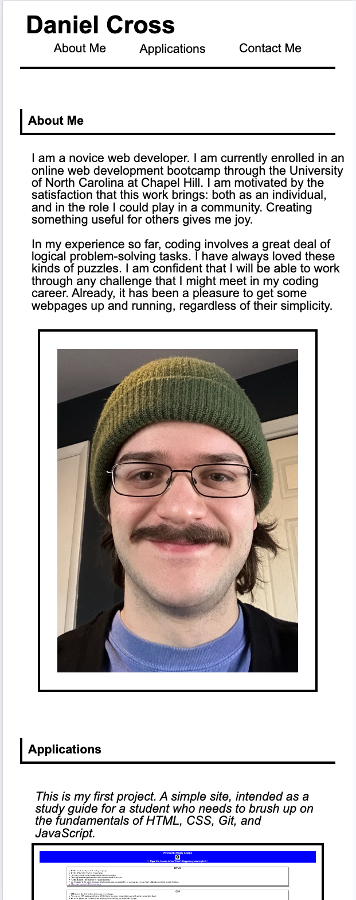

# Daniel Cross's Portfolio

## Description

This site was developed as a basic portfolio webpage for myself. This site will tell a potential employer about me, show a profile image of me, showcase my web development work, and give my contact info.

This site features responsive design: it will adapt to any screen size.

I also used pseudoelements and pseudoclasses in this project. This allows some basic interactivity with the design of the webpage. 

Through this project, I learned and applied the following advanced CSS topics:
- Pseudoelements and pseudoclasses
- Flexbox design
- Viewport units
- Media queries
- Specificity of selectors

## Installation

Navigate here to visit this website: https://danrcross.github.io/challenge-2-cross/
Navigate here to visit the GitHub repository for this project: https://github.com/danrcross/challenge-2-cross

## Usage

This website has a couple of notable features. This site uses responsive design, and will adapt to smaller screens and mobile devices. Also: when viewing the "Applications" section, the border a site image will become red when the pointer hovers over an image. See this represented in the following screenshots:

## Credits

Reset.css sheet borrowed from in-class activity 11, week 2.
<meta> line in <head> of HTML borrowed from in-class activity 1, week 2.

## License
MIT License used

![License] (LICENSE)
